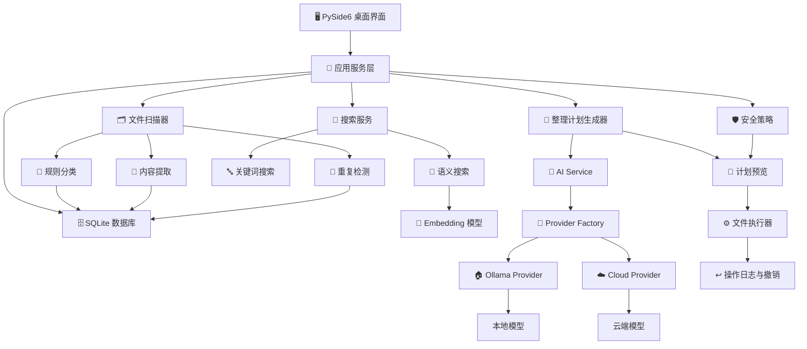

<div align="center">

# DiskWise

### 🧭 Local-first AI File Organizer

**把混乱的下载目录、课程资料、截图、安装包和工作文档，整理成可搜索、可预览、可撤销的智能文件工作台。**

[](https://www.python.org/)
[](https://doc.qt.io/qtforpython-6/)
[](https://www.sqlite.org/)
[](https://ollama.com/)
[](docs/ai-providers.md)
[](LICENSE)

</div>

---

## ✨ 项目定位

DiskWise 是一个面向 Windows 桌面的智能文件整理应用。它的目标不是简单地“批量移动文件”，而是建立一套完整的文件理解流程：

```text
扫描文件 → 提取信息 → 规则判断 → AI 理解 → 生成计划 → 安全预览 → 用户确认 → 执行并可撤销
```

项目优先使用本地 Ollama 模型，例如 Gemma，也预留 OpenAI 兼容云端 API。用户可以为不同任务选择不同模型，让分类、命名、图片理解和语义搜索各自使用最合适的能力。

> **核心原则：AI 负责理解和建议，DiskWise 负责校验和执行，用户保留最终决定权。**

---

## 🧩 功能蓝图

| 模块 | 能力 | 价值 |
|---|---|---|
| 🗂️ 文件扫描 | 授权目录扫描、元数据读取、保护目录排除 | 先建立清晰、可查询的文件索引 |
| 🧠 智能分类 | 扩展名规则 + 内容摘要 + AI 分类 | 区分课程资料、安装包、截图、文档和压缩包 |
| ✍️ 智能命名 | 根据文件内容生成建议名称 | 把 `新建文档(7).pdf` 变成更可读的文件名 |
| 🖼️ 图片理解 | 理解截图、票据、课件、报错图片 | 给截图和图片生成有意义的分类和名称 |
| 🔎 语义搜索 | Embedding 向量搜索 + 关键词搜索 | 用“找上学期 SQL 实验报告”这类自然语言找文件 |
| 🧬 重复检测 | 大小、快速哈希、完整哈希 | 找出重复下载、重复截图和重复压缩包 |
| 📦 大文件分析 | 按大小、类型、时间筛选 | 快速定位占空间的安装包、视频和旧文件 |
| 🧾 整理计划 | 移动、重命名、归档建议 | 执行前看到完整变化，不盲目改文件 |
| 🛡️ 安全执行 | 用户确认、路径校验、撤销日志 | 降低误删、误移、误传云端的风险 |
| ⚙️ 多模型配置 | 本地模型和云端 API 按任务选择 | 不绑定单一模型，不锁死技术路线 |

---

## 🌟 特点优势

### 🏠 本地优先

- 默认使用本机 Ollama。
- 文件内容优先留在本地。
- 不需要默认上传到云端。
- 适合个人资料、课程文档、截图和下载目录整理。

### 🔀 多模型可切换

DiskWise 不把模型写死在代码中。不同任务可以绑定不同模型：

| 任务 | 推荐模型类型 |
|---|---|
| 文件分类 | 本地文本模型，例如 `gemma4:e2b` |
| 智能命名 | 更强文本模型，例如 `gemma4:e4b` 或其他 Ollama 模型 |
| 图片理解 | 支持视觉输入的多模态模型 |
| 语义搜索 | Embedding 模型 |
| 云端增强 | OpenAI 兼容 API |

### 🧱 模块化单体

第一阶段不拆微服务，而是采用清晰的模块化单体：

- 更容易调试。
- 更适合桌面应用。
- 更适合学习 Python 工程结构。
- 后续仍可按模块拆分。

### 🧯 安全边界清楚

- AI 不直接操作文件。
- 云端 API 默认关闭。
- 文件操作必须先生成计划。
- 用户确认后才执行。
- 操作日志用于撤销。
- 不请求管理员权限。

### 🎓 适合学习

这个项目能串起一条完整学习路线：

```text
Python 基础
→ pathlib 文件处理
→ SQLite 数据库
→ PySide6 桌面界面
→ Pydantic 数据校验
→ Ollama 本地模型 API
→ Embedding 语义搜索
→ 安全文件操作
```

---

## 🖼️ 使用场景

### 场景一：下载目录整理

```text
D:\Downloads
├─ setup.exe
├─ CUDA安装包.zip
├─ 新建文档(7).pdf
├─ Screenshot_2026-06-13.png
└─ 课程资料最终版.docx
```

DiskWise 可以识别安装包、课程资料、截图、压缩包和重复文件，并生成整理建议。

### 场景二：课程资料归档

```text
数据库系统原理实验三.pdf
机器学习作业报告.docx
概率论复习资料.pdf
```

整理建议示例：

```text
课程资料/数据库/数据库系统原理-实验三.pdf
课程资料/机器学习/机器学习-作业报告.docx
课程资料/数学/概率论-复习资料.pdf
```

### 场景三：截图和报错命名

```text
Screenshot_2026-06-13.png
→ Python-PySide6-ModuleNotFoundError.png
```

### 场景四：自然语言找文件

```text
找上学期写的 SQL 实验报告
找去年下载的大于 500MB 的安装包
找和 PySide6 报错有关的截图
```

---

## 🏗️ 系统架构



---

## 🤖 AI 能力设计

业务代码只依赖统一 Provider 接口：

```python
class AIProvider:
    health_check()
    list_models()
    generate(request)
    embed(request)
```

### Provider 类型

| Provider | 用途 |
|---|---|
| 🏠 `OllamaProvider` | 调用本机 `http://localhost:11434`，自动发现本地模型 |
| ☁️ `OpenAICompatibleProvider` | 调用用户显式配置的云端 API |

### 任务模型配置

```text
classification → 文件分类模型
renaming       → 智能命名模型
vision         → 图片理解模型
embeddings     → 语义搜索向量模型
```

### 隐私策略

- 本地模型失败时不自动切换云端。
- 云端 API 必须显式启用。
- 云端调用必须经过隐私授权。
- API 密钥不写入 Git、SQLite 或日志。
- 模型权重不进入仓库。

---

## 🗃️ 数据设计

DiskWise 使用 SQLite 保存结构化信息，而不是把用户文件复制进数据库。

| 数据 | 保存内容 |
|---|---|
| 文件索引 | 路径、大小、扩展名、修改时间、哈希 |
| 内容摘要 | PDF、Word、图片 OCR 或截图理解摘要 |
| 分类结果 | 规则分类和 AI 分类结果 |
| 模型配置 | 各任务使用哪个 Provider 和模型 |
| 整理计划 | 建议移动、重命名、归档操作 |
| 操作日志 | 执行记录和撤销信息 |

正式运行数据默认位于：

```text
%LOCALAPPDATA%\DiskWise
```

---

## 📁 完整项目结构

```text
diskwise/
├─ pyproject.toml                  # 项目配置和 Python 依赖
├─ README.md                       # GitHub 项目首页
├─ LICENSE                         # MIT 开源许可证
├─ .gitignore                      # 排除虚拟环境、数据库、缓存、密钥等
├─ .env.example                    # 云端 API 配置示例，不包含真实密钥
│
├─ .vscode/                        # VS Code 推荐配置
│  ├─ settings.json
│  └─ extensions.json
│
├─ src/
│  └─ diskwise/
│     ├─ __init__.py
│     ├─ main.py                   # 程序启动入口
│     │
│     ├─ config/                   # 应用配置
│     │  ├─ paths.py               # 运行数据目录选择
│     │  └─ settings.py            # 环境变量配置读取
│     │
│     ├─ ui/                       # PySide6 桌面界面
│     │  ├─ main_window.py         # 主窗口和四个页面入口
│     │  ├─ placeholder_page.py    # 页面占位组件
│     │  └─ settings_page.py       # 本地/云端模型设置页
│     │
│     ├─ database/                 # SQLite 数据库
│     │  ├─ connection.py          # 数据库连接
│     │  ├─ schema.py              # 表结构定义
│     │  ├─ migrations.py          # 幂等初始化
│     │  └─ repositories/
│     │     └─ model_config_repository.py
│     │
│     ├─ ai/                       # AI 统一能力层
│     │  ├─ schemas.py             # Pydantic 输入输出结构
│     │  ├─ service.py             # 业务层统一入口
│     │  └─ providers/
│     │     ├─ base.py             # AIProvider 抽象接口
│     │     ├─ factory.py          # Provider 创建工厂
│     │     ├─ ollama_provider.py  # 本地 Ollama 调用
│     │     └─ openai_compatible_provider.py
│     │
│     ├─ safety/                   # 安全和隐私策略
│     │  └─ privacy_policy.py      # 云端调用显式授权检查
│     │
│     ├─ executor/                 # 文件操作层
│     │  └─ service.py             # 移动、重命名、删除接口
│     │
│     ├─ scanner/                  # 文件遍历和元数据读取
│     ├─ rules/                    # 确定性分类规则
│     ├─ extractors/               # PDF、Word、图片、代码内容提取
│     ├─ search/                   # 关键词搜索和语义搜索
│     ├─ duplicates/               # 重复文件检测
│     ├─ planner/                  # 整理计划生成
│     └─ logging/                  # 程序日志配置
│        └─ setup.py
│
├─ tests/                          # 自动测试
│  ├─ conftest.py
│  ├─ test_database.py
│  ├─ test_executor.py
│  ├─ test_ollama_provider.py
│  ├─ test_privacy.py
│  └─ test_ui.py
│
├─ data/                           # 开发期运行数据目录示例
│  ├─ .gitkeep
│  ├─ vectors/.gitkeep             # 语义向量索引
│  ├─ cache/.gitkeep               # 提取内容和模型结果缓存
│  └─ logs/.gitkeep                # 运行日志
│
└─ docs/                           # 项目设计文档
   ├─ architecture.md
   ├─ ai-providers.md
   ├─ database.md
   ├─ privacy.md
   └─ safety.md
```

---

## 🧭 模块地图

| 路径 | 角色 |
|---|---|
| 🖥️ `ui/` | 桌面界面、页面布局、模型设置入口 |
| 🗄️ `database/` | SQLite 连接、表结构、配置仓储 |
| 🤖 `ai/` | Provider 抽象、本地 Ollama、云端 API |
| 🛡️ `safety/` | 云端授权、路径策略、操作校验 |
| ⚙️ `executor/` | 文件移动、重命名、删除与撤销 |
| 🗂️ `scanner/` | 文件遍历、元数据读取 |
| 📏 `rules/` | 扩展名、大小、类型等确定性规则 |
| 📄 `extractors/` | PDF、Word、图片、代码内容提取 |
| 🔎 `search/` | 关键词搜索、语义搜索 |
| 🧬 `duplicates/` | 重复文件检测 |
| 🧾 `planner/` | 整理计划生成 |

---

## 🚀 快速开始

### 1. 克隆项目

```powershell
git clone https://github.com/DoTrungHuy/DiskWise.git
cd DiskWise
```

### 2. 创建环境

```powershell
C:\Python\Python312\python.exe -m venv .venv
.\.venv\Scripts\python.exe -m pip install -e ".[dev]"
```

### 3. 启动应用

```powershell
.\.venv\Scripts\python.exe -m diskwise.main
```

或：

```powershell
.\.venv\Scripts\diskwise.exe
```

---

## 🏠 本地模型

如果使用 Ollama：

```powershell
ollama pull gemma4:e2b
ollama list
```

DiskWise 会读取本机 Ollama 模型列表，不局限于 Gemma。

---

## ☁️ 云端 API

复制 `.env.example` 中的变量到自己的环境中。真实密钥不要提交到仓库。

```text
DISKWISE_CLOUD_ENABLED=false
DISKWISE_CLOUD_BASE_URL=https://example.com/v1
DISKWISE_CLOUD_API_KEY=your-api-key-here
```

云端默认关闭。真正发送文件摘要前，需要经过隐私策略检查。

---

## ✅ 测试

```powershell
.\.venv\Scripts\python.exe -m pytest -q
.\.venv\Scripts\python.exe -m compileall -q src tests
.\.venv\Scripts\python.exe -m pip check
```

测试覆盖：

- SQLite 幂等初始化。
- 任务模型配置保存。
- Ollama 多模型发现。
- Ollama 离线错误提示。
- 云端调用显式授权。
- API 密钥不写入 SQLite。
- 文件操作安全边界。
- PySide6 主窗口四页启动。

---

## 🛣️ 路线图

| 阶段 | 状态 | 目标 |
|---|---|---|
| v0.1 | ✅ 已完成 | 应用框架、模型配置、安全边界 |
| v0.2 | ✅ 已完成 | 用户授权目录扫描、SQLite 文件索引、规则分类、关键词搜索、重复检测、计划预览 |
| v0.3 | 🚧 下一步 | 批量执行确认 UI、操作日志页面、完整撤销流程 |
| v0.4 | 🚧 下一步 | 本地 Gemma 分类、智能命名和图片理解的界面化流程 |
| v0.5 | 🚧 下一步 | Embedding 模型接入、关键词和语义混合搜索排序 |
| v1.0 | 🎯 目标 | Windows 打包、完整安全文档、示例数据和演示视频 |

---

## 🛡️ 设计底线

DiskWise 的文件整理能力必须满足：

- 用户授权目录后才能扫描。
- 默认只读。
- 计划先预览。
- 用户确认后才执行。
- 操作可撤销。
- 不请求管理员权限。
- 系统目录默认禁止。
- 云端传输必须显式授权。

---

## 📜 License

MIT License. See [LICENSE](LICENSE).
