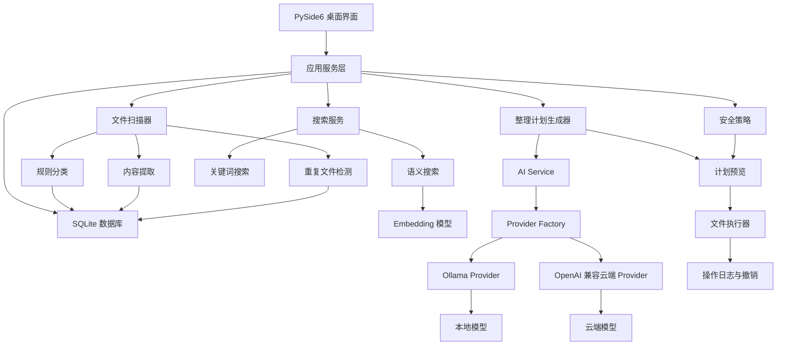

# DiskWise

> 本地优先、模型可切换、默认安全的智能文件整理桌面应用。

[](https://www.python.org/)
[](https://doc.qt.io/qtforpython-6/)
[](https://www.sqlite.org/)
[](https://ollama.com/)
[](LICENSE)

DiskWise 面向长期积累了大量下载文件、课程资料、图片截图、安装包和工作文档的用户。
它希望把“找文件、看文件、分类文件、整理文件”做成一个可预览、可确认、可撤销的桌面工作流。

项目优先使用本地 Ollama 模型，例如 Gemma，也支持可选的 OpenAI 兼容云端 API。
用户可以为不同任务选择不同模型：分类用一个模型，命名用另一个模型，图片理解和语义搜索也可以分别配置。

核心原则很简单：

> AI 负责理解和建议，程序负责校验和执行，用户保留最终决定权。

---

## 功能全景

| 能力 | 说明 |
|---|---|
| 智能文件分类 | 结合扩展名规则、文件元数据、内容摘要和 AI 理解，判断文件类别 |
| 智能重命名 | 根据文档标题、截图内容、课程信息或安装包信息生成更清楚的文件名 |
| 图片理解 | 识别截图、票据、报错、课件和照片内容，用于分类和命名 |
| 语义搜索 | 用 Embedding 模型按含义搜索文件，而不只依赖关键词 |
| 重复文件检测 | 通过大小、快速哈希和完整哈希识别重复文件 |
| 大文件分析 | 找出占空间的安装包、视频、压缩包和历史下载内容 |
| 整理计划预览 | 在真正移动或重命名前展示“原位置 → 新位置”的完整对比 |
| 安全执行 | 用户确认后才执行文件操作，并记录撤销信息 |
| 本地模型优先 | 默认通过 Ollama 调用本机模型，减少隐私风险 |
| 云端模型可选 | 可接入 OpenAI 兼容 API，但必须由用户显式启用 |

---

## 特点优势

### 本地优先

DiskWise 的默认路线是本地运行：

- 文件内容优先留在电脑上。
- 本地 Ollama 模型无需云端 API Key。
- 模型可以是 Gemma，也可以是其他 Ollama 模型。
- 适合课程资料、个人文件、截图和下载目录整理。

### 多模型可切换

DiskWise 不把模型写死在代码里。不同任务可以选择不同模型：

```text
文件分类   → gemma4:e2b
智能命名   → gemma4:e4b / 其他文本模型
图片理解   → 支持视觉输入的模型
语义搜索   → Embedding 模型
```

未来如果用户更换本地模型或接入云端 API，业务层不需要重写。

### 安全优先

DiskWise 不让 AI 直接碰文件系统：

- AI 只返回结构化建议。
- 程序负责路径映射和安全检查。
- 用户确认后才执行。
- 文件变化后计划自动失效。
- 删除默认进入回收站。
- 操作日志用于撤销。

### 桌面应用体验

项目选择 PySide6，是为了做成真正的 Windows 桌面工具：

- 选择目录。
- 查看扫描进度。
- 表格展示文件。
- 对比整理前后路径。
- 勾选确认操作。
- 设置本地或云端模型。

### 适合学习和二次开发

DiskWise 使用模块化单体结构，适合 Python 学习者逐步理解：

- `scanner/` 学文件遍历。
- `database/` 学 SQLite。
- `rules/` 学确定性分类。
- `ai/` 学 Ollama 和云端 API。
- `ui/` 学 PySide6 桌面界面。
- `safety/` 学文件操作边界。

---

## 适用场景

### 下载目录整理

```text
D:\Downloads
├─ setup.exe
├─ CUDA安装包.zip
├─ 新建文档(7).pdf
├─ Screenshot_2026-06-13.png
└─ 课程资料最终版.docx
```

DiskWise 可以帮助识别安装包、课程资料、截图、压缩包和重复文件，并生成整理建议。

### 课程资料归档

```text
数据库系统原理实验三.pdf
机器学习作业报告.docx
概率论复习资料.pdf
```

AI 可以根据文件名和内容摘要建议：

```text
课程资料/数据库/数据库系统原理-实验三.pdf
课程资料/机器学习/机器学习-作业报告.docx
课程资料/数学/概率论-复习资料.pdf
```

### 截图和报错整理

```text
Screenshot_2026-06-13.png
```

图片理解可以识别截图里的 IDE、错误信息和上下文，生成更有意义的名称：

```text
Python-PySide6-ModuleNotFoundError.png
```

### 按语义找文件

用户可以搜索：

```text
找上学期写的 SQL 实验报告
```

语义搜索不只看文件名，而是根据文档含义找到相关资料。

---

## 系统架构



## AI 调用设计

业务代码只依赖统一接口：

```python
class AIProvider:
    health_check()
    list_models()
    generate(request)
    embed(request)
```

当前 Provider：

- `OllamaProvider`：调用本机 `http://localhost:11434`，自动发现已安装模型。
- `OpenAICompatibleProvider`：支持 OpenAI 兼容云端 API，默认关闭。

调用策略：

- 本地 Ollama 优先。
- 本地模型失败时不自动切换云端。
- 云端 API 必须显式启用。
- API 密钥不写入 Git、SQLite 或日志。
- 模型权重不进入仓库。

---

## 完整项目骨架

```text
diskwise/
├─ pyproject.toml                  # 项目配置和 Python 依赖
├─ README.md                       # GitHub 项目首页
├─ LICENSE                         # MIT 开源许可证
├─ .gitignore                      # 排除虚拟环境、数据库、缓存、密钥等
├─ .env.example                    # 云端 API 配置示例，不包含真实密钥
│
├─ .vscode/                        # VS Code 推荐配置
│  ├─ settings.json
│  └─ extensions.json
│
├─ src/
│  └─ diskwise/
│     ├─ __init__.py
│     ├─ main.py                   # 程序启动入口
│     │
│     ├─ config/                   # 应用配置
│     │  ├─ paths.py               # 运行数据目录选择
│     │  └─ settings.py            # 环境变量配置读取
│     │
│     ├─ ui/                       # PySide6 桌面界面
│     │  ├─ main_window.py         # 主窗口和四个页面入口
│     │  ├─ placeholder_page.py    # 页面占位组件
│     │  └─ settings_page.py       # 本地/云端模型设置页
│     │
│     ├─ database/                 # SQLite 数据库
│     │  ├─ connection.py          # 数据库连接
│     │  ├─ schema.py              # 表结构定义
│     │  ├─ migrations.py          # 幂等初始化
│     │  └─ repositories/
│     │     └─ model_config_repository.py
│     │
│     ├─ ai/                       # AI 统一能力层
│     │  ├─ schemas.py             # Pydantic 输入输出结构
│     │  ├─ service.py             # 业务层统一入口
│     │  └─ providers/
│     │     ├─ base.py             # AIProvider 抽象接口
│     │     ├─ factory.py          # Provider 创建工厂
│     │     ├─ ollama_provider.py  # 本地 Ollama 调用
│     │     └─ openai_compatible_provider.py
│     │
│     ├─ safety/                   # 安全和隐私策略
│     │  └─ privacy_policy.py      # 云端调用显式授权检查
│     │
│     ├─ executor/                 # 文件操作层
│     │  └─ service.py             # 移动、重命名、删除接口
│     │
│     ├─ scanner/                  # 文件遍历和元数据读取
│     ├─ rules/                    # 确定性分类规则
│     ├─ extractors/               # PDF、Word、图片、代码内容提取
│     ├─ search/                   # 关键词搜索和语义搜索
│     ├─ duplicates/               # 重复文件检测
│     ├─ planner/                  # 整理计划生成
│     └─ logging/                  # 程序日志配置
│        └─ setup.py
│
├─ tests/                          # 自动测试
│  ├─ conftest.py
│  ├─ test_database.py
│  ├─ test_executor.py
│  ├─ test_ollama_provider.py
│  ├─ test_privacy.py
│  └─ test_ui.py
│
├─ data/                           # 开发期运行数据目录示例
│  ├─ .gitkeep
│  ├─ vectors/.gitkeep             # 语义向量索引
│  ├─ cache/.gitkeep               # 提取内容和模型结果缓存
│  └─ logs/.gitkeep                # 运行日志
│
└─ docs/                           # 项目设计文档
   ├─ architecture.md
   ├─ ai-providers.md
   ├─ database.md
   ├─ privacy.md
   └─ safety.md
```

---

## 安装与运行

```powershell
cd D:\DiskWise
C:\Python\Python312\python.exe -m venv .venv
.\.venv\Scripts\python.exe -m pip install -e ".[dev]"
```

启动应用：

```powershell
.\.venv\Scripts\python.exe -m diskwise.main
```

或：

```powershell
.\.venv\Scripts\diskwise.exe
```

## 本地模型

如果使用 Ollama：

```powershell
ollama pull gemma4:e2b
ollama list
```

DiskWise 会读取本机 Ollama 模型列表，不局限于 Gemma。用户可以选择其他本地模型。

## 云端 API

复制 `.env.example` 中的变量到自己的环境中。真实密钥不要提交到仓库。

```text
DISKWISE_CLOUD_ENABLED=false
DISKWISE_CLOUD_BASE_URL=https://example.com/v1
DISKWISE_CLOUD_API_KEY=your-api-key-here
```

云端默认关闭。真正发送文件摘要前，需要经过隐私策略检查。

---

## 运行数据

正式运行时，运行数据默认位于：

```text
%LOCALAPPDATA%\DiskWise
```

| 路径 | 用途 |
|---|---|
| `diskwise.db` | SQLite 配置和文件索引 |
| `vectors/` | 语义搜索向量索引 |
| `cache/` | 内容提取和模型结果缓存 |
| `logs/` | 程序运行日志 |

仓库中的 `data/` 只保留目录结构，不保存真实用户数据。

---

## 测试

```powershell
.\.venv\Scripts\python.exe -m pytest -q
.\.venv\Scripts\python.exe -m compileall -q src tests
.\.venv\Scripts\python.exe -m pip check
```

测试覆盖：

- SQLite 幂等初始化。
- 任务模型配置保存。
- Ollama 多模型发现。
- Ollama 离线错误提示。
- 云端调用显式授权。
- API 密钥不写入 SQLite。
- 文件操作安全边界。
- PySide6 主窗口四页启动。

---

## 路线图

| 版本 | 目标 |
|---|---|
| v0.1 | 应用框架、模型配置、安全边界 |
| v0.2 | 用户授权目录扫描、SQLite 文件索引、规则分类 |
| v0.3 | 内容提取、重复文件检测、大文件查询 |
| v0.4 | 本地模型分类、智能命名、计划预览 |
| v0.5 | Embedding 模型、关键词和语义混合搜索 |
| v1.0 | 安全执行、撤销、Windows 打包、完整文档 |

---

## 设计底线

> AI 可以提出建议，但不能直接操作用户文件。

DiskWise 的文件整理能力必须满足：

- 用户授权目录后才能扫描。
- 默认只读。
- 计划先预览。
- 用户确认后才执行。
- 操作可撤销。
- 不请求管理员权限。
- 系统目录默认禁止。
- 云端传输必须显式授权。

## License

MIT License. See [LICENSE](LICENSE).

