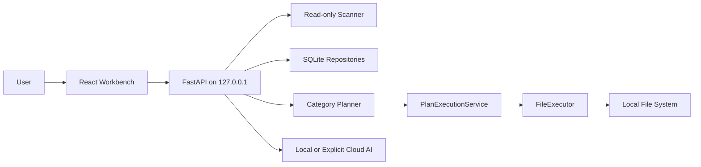

# Web Workbench Threat Model

本文件记录 Web workbench 启用真实批量执行前的威胁模型。结论基于当前代码审阅和本地测试，尚未经过外部安全评审。

## 范围

纳入范围：

- `src/diskwise/api/` 的 FastAPI 本地接口。
- `src/diskwise/planner/execution_service.py` 的计划执行和撤销。
- `src/diskwise/executor/service.py` 的文件移动和 undo。
- `src/diskwise/safety/` 的路径、目标和云端隐私策略。
- `web/` 的本地浏览器工作台原型。

不纳入范围：

- Tauri 或安装包分发。
- 多用户远程访问。
- 云端模型服务本身的供应链风险。

## 系统图

## 关键资产

- 用户文件内容、文件名、路径、mtime 和大小。
- SQLite 索引、摘要、分类、哈希和操作日志。
- 整理计划中的 source path、target path 和 reason。
- undo data。
- 云端 API key 和模型配置。

## 威胁与控制

| ID | 风险 | 当前控制 | 仍需补强 |
| --- | --- | --- | --- |
| TM-001 | 浏览器页面或恶意本地网页调用 localhost API 触发扫描或移动 | API 绑定 `127.0.0.1`，CORS 仅允许本地前端，执行需要 `EXECUTE` | 为 Web 会话增加随机本地 token，所有 mutating API 要求 token |
| TM-002 | 计划生成后文件被外部修改，旧计划错误移动新内容 | 执行前重新检查 source path、size、mtime | 对已有 hash 的文件增加 hash recheck；UI 显示 stale 状态 |
| TM-003 | target path 被构造为目录逃逸或写入系统目录 | target 会经过 `assert_target_within_root` 和 `validate_destination`；冲突自动 suffix | 在 plan 表中持久化 target root，让执行时按整批 root 校验 |
| TM-004 | 摘要、路径或敏感文件内容被发送到云端 AI | 云端默认关闭，调用云端需要显式 consent，敏感文件拒绝云端 | Web UI 需要显示每个 AI 动作是否本地或云端，并记录 consent 来源 |
| TM-005 | 大目录扫描、重复文件 hash 或摘要提取造成 UI/API 卡死 | 扫描有最大文件数，跳过系统目录、symlink 和缓存目录 | Web API 应改成后台 job，并提供取消、进度和速率限制 |
| TM-006 | undo 被重复调用或撤销到冲突路径 | 操作日志记录 status，undo 使用 executor 校验源和目标 | undo 前也应显示 before/after，并要求 `EXECUTE`；后续增加幂等检查 |

## 执行前必须满足

- 所有真实移动仍必须从 Plans 进入，且确认文本精确匹配 `EXECUTE`。
- Library、Search、Dashboard 不能直接暴露移动、删除或重命名入口。
- 执行时必须重新读取源文件状态，拒绝缺失或已变化的源文件。
- 操作日志必须记录可撤销操作的原路径和现路径。
- 任何云端 AI 调用必须保持显式 opt-in，且敏感文件不能发送。

## 建议下一步

1. 给本地 API 增加启动时生成的 session token。
2. 把扫描和计划执行改成 job model，避免请求长时间占用。
3. 在数据库里保存 plan target root，执行阶段按 root 统一校验。
4. 在 Web UI 中增加 stale/conflict 的批量过滤。
5. 为 undo 增加已撤销检查，防止重复撤销造成误移动。
